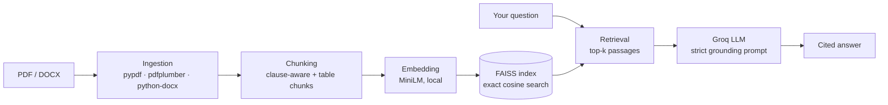

<div align="center">

# Citewell

### Ask your contracts and financial filings anything.<br>Every answer shows exactly where it came from.

<br>


[**Quick start**](#-quick-start) &nbsp;·&nbsp; [**Features**](#-features) &nbsp;·&nbsp; [**How it works**](#-how-it-works) &nbsp;·&nbsp; [**Evaluation**](#-evaluation) &nbsp;·&nbsp; [**Author**](#-author)

</div>

<br>

<!--
  Add a screenshot of the app here:
  1. Save it as docs/screenshot.png
  2. Delete this comment's start and end lines, keeping the line below

  <p align="center"></p>
-->

## The problem

Contracts, leases, loan agreements and annual reports are long, dense, and unforgiving. A chatbot that sounds confident but quietly invents a number is worse than no tool at all.

**Citewell is built around one rule: no claim without a source.** It answers only from the documents you give it, says so plainly when the answer isn't there, and shows the exact passage behind every statement so you can check it in seconds.

## See it work

> **You:** What is the monthly rent and when is it due?
>
> **Citewell:** The lease specifies a monthly rent of **$2,400.00**, due on the 1st day of each month **[1]**
>
> **[1]** `sample_lease_agreement.pdf`, Clause 3 (RENT), page 1

And when the answer isn't in the documents, it doesn't guess:

> **You:** What is the tenant's phone number?
>
> **Citewell:** The retrieved documents don't contain enough information to answer this question.

## ✨ Features

| | |
|---|---|
| **Cited answers** | Numbered marks in each answer map to the source passages beneath it, split into passages the answer used and passages that were only retrieved. |
| **Clause-aware chunking** | Numbered legal clauses stay whole instead of being sliced mid-sentence by fixed-size splitting. |
| **Real table extraction** | Financial statements keep their rows and columns (via `pdfplumber`), instead of turning into a jumble of numbers. |
| **GAAP vs. Non-GAAP aware** | Headings above tables are detected and shown in citations, so two correct but different figures don't look like a conflict. |
| **Bring your own documents** | Upload PDF or Word files and ask questions in the same session. Nothing is stored. |
| **Safe by default** | Uploads are validated, model output is HTML-escaped, the index is JSON (never pickle), and document text is treated as data, not instructions. |
| **Friendly failures** | Damaged PDFs, password-protected files, scanned images, rate limits and bad API keys each get a clear message, never a traceback. |
| **Measured, not asserted** | Retrieval (MRR, Recall, Precision) and answer faithfulness (LLM-as-judge) are scored against a hand-labelled test set. |

Runs locally and free, apart from the language-model call, which uses Groq's free tier.

## 🚀 Quick start

You need **Python 3.11** and a free **Groq API key** from [console.groq.com/keys](https://console.groq.com/keys).

<details open>
<summary><b>Windows (Anaconda Prompt)</b></summary>

```bat
git clone https://github.com/sami7507/citewell.git
cd citewell

conda create -n citewell python=3.11 -y
conda activate citewell
pip install -r requirements.txt

copy config\.env.example .env
run_app.bat
```
</details>

<details>
<summary><b>macOS / Linux</b></summary>

```bash
git clone https://github.com/sami7507/citewell.git
cd citewell
python -m venv venv && source venv/bin/activate
pip install -r requirements.txt

cp config/.env.example .env
./run_app.sh
```
</details>

The app opens at **http://localhost:8501**. No need to edit `.env` first: if no key is set, the page asks you to paste one for the session. The first run downloads the embedding model (about 90 MB) and builds the sample index.

> **Sample documents:** put your PDFs in `storage/sample_docs/`, or run `python scripts/generate_sample_docs.py` to create synthetic ones (needs `pip install reportlab`).

### Using the app

1. Pick **Sample documents** (a lease, a loan agreement, a 10-K excerpt and financial statements) or **My documents** to upload your own.
2. Ask a question, or click one of the suggestions.
3. Read the answer. The numbered marks match the passages under **Sources**.
4. Rate the answer **Helpful** or **Not helpful**.

### Command line

```bash
python scripts/build_index.py                        # rebuild the sample index
python scripts/cli.py --ask "What is the monthly rent?"
python scripts/run_eval.py                           # retrieval + faithfulness evaluation (uses Groq)
python scripts/run_embedding_comparison.py           # compare embedding models
```

## 🧠 How it works



Design decisions and their trade-offs are written up in [docs/ARCHITECTURE.md](docs/ARCHITECTURE.md).

<details>
<summary><b>Project structure</b></summary>

```
citewell/
├── backend/citewell/          # the Python package: all business logic, no UI
│   ├── config.py              # every setting, read from the environment
│   ├── pipeline.py            # ingest -> chunk -> embed -> index, and answer_question()
│   ├── ingestion/             # PDF / DOCX loaders, table extraction
│   ├── chunking/              # clause-aware and recursive chunkers
│   ├── embeddings/            # local sentence-transformers wrapper
│   ├── vectorstore/           # FAISS store with safe JSON persistence
│   ├── retrieval/             # query -> embed -> search -> ranked passages
│   ├── generation/            # grounded prompt, Groq call, error handling
│   ├── services/              # uploads, sample index, secrets bridging
│   ├── storage/               # SQLite feedback database
│   ├── evaluation/            # metrics, faithfulness judge, eval runner, test sets
│   └── utils/                 # rate-limit backoff
├── frontend/                  # Streamlit UI (app.py, theme.py, components.py)
├── storage/                   # sample_docs/, generated index, database, eval reports
├── config/                    # .env.example, secrets.toml.example
├── scripts/                   # CLI, evaluation and sample-data tools
├── tests/                     # 160+ tests
├── .streamlit/config.toml     # Streamlit theme and server settings
└── Dockerfile, requirements*.txt, pytest.ini, .github/workflows/ci.yml
```

The backend never imports Streamlit, and the frontend contains only presentation. The same `pipeline` functions serve the app, the command line, the evaluation harness and the tests.
</details>

<details>
<summary><b>Configuration</b></summary>

All settings are environment variables (in `.env`, or Streamlit secrets when deployed).

| Variable | Default | Purpose |
|---|---|---|
| `GROQ_API_KEY` | none | Free key from console.groq.com |
| `GROQ_MODEL` | `openai/gpt-oss-120b` | Language model served by Groq |
| `EMBEDDING_MODEL` | `sentence-transformers/all-MiniLM-L6-v2` | Local embedding model |
| `TOP_K` / `UPLOAD_TOP_K` | `2` / `4` | Passages per answer for samples / uploads |
| `MAX_UPLOAD_FILES`, `MAX_UPLOAD_MB` | `5`, `50` | Upload limits |
| `SAMPLE_DOCS_DIR`, `VECTORSTORE_DIR`, `DATABASE_PATH` | under `storage/` | Where data lives |

See `config/.env.example` for the full list. Changing the embedding model rebuilds the sample index automatically.
</details>

## 📊 Evaluation

Measured on the project's hand-labelled set (23 questions across the four sample documents) before the latest rebuild. Retrieval and chunking logic are unchanged, but the generation prompt gained one safety rule, so run `python scripts/run_eval.py` to refresh the faithfulness numbers on your machine.

<table>
<tr>
<td valign="top">

**Retrieval** (`top_k = 2`)

| Metric | Score |
|---|---|
| MRR | **0.917** |
| Recall@2 | **1.000** |
| Precision@2 | 0.500 |

</td>
<td valign="top">

**Faithfulness** (LLM-as-judge)

| Metric | Score |
|---|---|
| Average | **4.83 / 5** |
| Faithful rate | **94.4%** |

17 of 18 answers fully supported.

</td>
</tr>
</table>

- **Why `top_k = 2`?** It was tested at 1, 2, 4 and 6. Recall and MRR plateau at 2, and larger values only dilute precision.
- **The one flagged answer** was a citation mix-up between two adjacent clauses, not a hallucination.
- **Why MiniLM?** The larger `all-mpnet-base-v2` gained only +0.043 MRR but embedded about 6x slower, and both reached perfect recall.

| Embedding model | Dim | MRR | Recall@k | Embed time |
|---|---|---|---|---|
| all-MiniLM-L6-v2 (default) | 384 | 0.891 | 1.000 | 0.63 s |
| all-mpnet-base-v2 | 768 | 0.935 | 1.000 | 3.93 s |

The labelled set lives in `backend/citewell/evaluation/test_sets/`. The repository ships a small `starter_*.json` placeholder; replace it with your own labels (see the README in that folder).

## 🔍 Lessons from real documents

Testing on a real, unmodified 176-page annual report exposed three problems the sample corpus never showed. Each was traced to its root cause and fixed:

1. **Split currency columns.** The `$` sat in its own PDF column, so every figure became two cells. Fixed by merging columns that contain only currency symbols.
2. **GAAP vs. Non-GAAP tables.** Two identical-looking tables differed only by a heading above each. Fixed by detecting that heading and surfacing it in the citation: `Table 1 (GAAP), page 24`.
3. **Invented units.** Units like "in thousands" are often stated once, elsewhere, so a model can make up a scale word for a bare number. Mitigated with an explicit rule never to invent a scale.

## 🛡️ Security and privacy

- Uploaded files are processed in memory and in a temporary folder that is deleted immediately. They are never stored.
- A key pasted into the page lives only in that browser session's memory.
- The vector index is JSON plus a FAISS file. Earlier versions used pickle, which can run code when loaded; old pickle indexes are refused and rebuilt.
- Answers and passages are HTML-escaped before they are shown.
- Retrieved text reaches the model as untrusted data, with an explicit rule not to follow instructions found inside it.

## 🧪 Testing

```bash
pip install -r requirements-dev.txt
pytest -m "not integration"      # fast, offline tests
pytest                           # everything, including tests that download models or call the API
```

Tests that need the embedding model or a real `GROQ_API_KEY` are marked `integration`; the live-API ones skip themselves when no key is set.

## ☁️ Deployment

**Streamlit Community Cloud:** push the repository, set the main file to `frontend/app.py`, and paste `config/secrets.toml.example` (with your real key) into the app's Secrets. Keep `storage/sample_docs/` in the repository.

**Docker:**

```bash
docker build -t citewell .
docker run -p 8501:8501 -e GROQ_API_KEY=your_key citewell
```

## ⚠️ Known limitations

- **No OCR.** Scanned, image-only PDFs are detected and reported but not read.
- **Prose on table pages.** Pages containing a table are indexed through table extraction only, so ordinary text on the same page isn't indexed separately.
- **Prose can outrank tables** when a sentence closely echoes the question. Retrieving more than one passage mitigates this.
- **No reranking stage.** Retrieval is single-pass dense search; a cross-encoder reranker would help on larger corpora.
- **Free-tier storage is ephemeral.** On Streamlit Community Cloud, feedback and the index reset when the app restarts.

## 🗺️ Roadmap

- [ ] Cross-encoder reranking
- [ ] OCR for scanned documents
- [ ] Multi-document comparison questions
- [ ] Hosted database for feedback, and promotion of well-rated answers into the evaluation set
- [ ] Optional fully local language model backend

## 👤 Author

<div align="center">

**Sami**

[samikhan75076@gmail.com](mailto:samikhan75076@gmail.com) &nbsp;·&nbsp; [LinkedIn](https://www.linkedin.com/in/sami7507)

<sub>Released under the MIT License.</sub>

</div>
